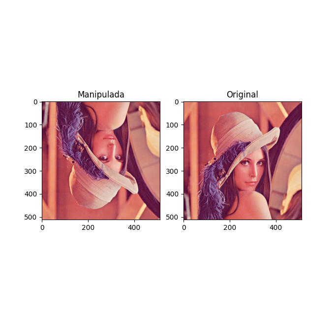
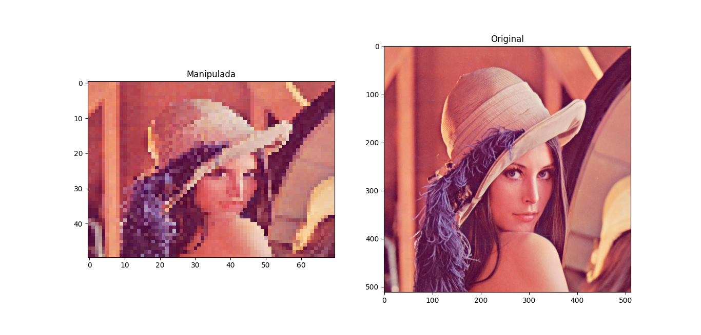
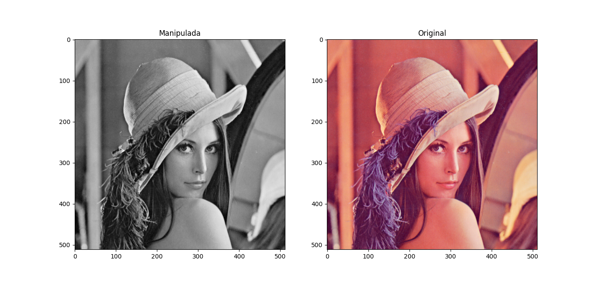
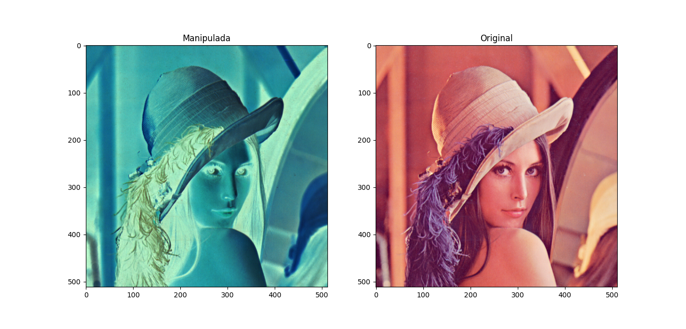

# Aplicações da Álgebra Linear em Computação Gráfica: _Manipulação de Imagem_

Este repositório tem por objetivo armazenar os códigos elaborados no Trabalho 1 da disciplina de Álgebra Linear [2023/2], ministrada pela Profª. Adriana Padua Lovatte.

### Autores
- Caio Lessa Simão: [@CaioLessaSimao](https://github.com/CaioLessaSimao)
- Davidson Carvalho dos Santos: [@Davidsonnj](https://github.com/Davidsonnj)
- Sofia de Alcantara: [@sofialctv](https://github.com/sofialctv)

O trabalho consiste em explorar a interseção entre a Álgebra Linear e a Computação Gráfica de forma introdutória, utilizando a linguagem de programação Python para explorar a manipulação de imagens.

O programa disponibiliza, por meio de um menu, as operações de:
- Espelhamento Vertical
- Espelhamento Horizonal
- Redimensionamento, com dimensões informadas pelo usuário
- Conversão RGB para tons de cinza
- Inversão de cores de uma imagem

# Saídas
- Espelhamento Vertical

- Espelhamento Horizonal

- Redimensionamento (exemplo com dimensões 50 x 70)

- Conversão RGB para tons de cinza

- Inversão de cores de uma imagem
